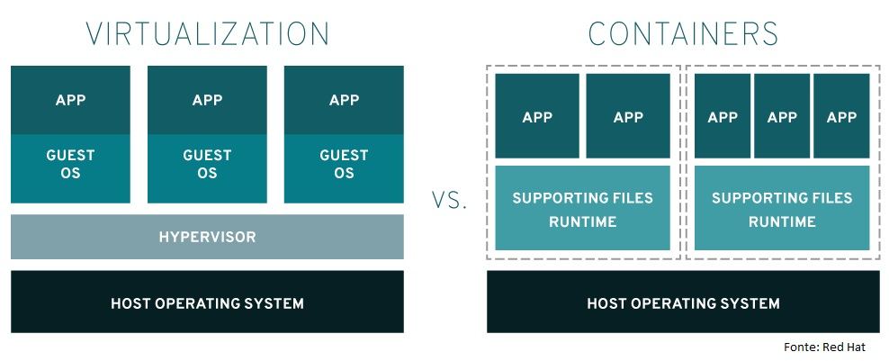

# O que é Docker?

Docker é uma ferramenta que nos permite conatinerizar e executar imagens de 
ferramentas e aplicações em ambientes isolados, os containers.

## Vantagens de usar docker
- simples na hora de executar
- multiplataforma
- baixo consumo de recursos
- poupa tempo de instalação e configuração
- simplesmente funciona

# Oque é uma imagem?
Imagine que você tem um programa (como um jogo) e você quer que as pessoas instalem/usem ele, 
mas você tem várias versões e gostaria que as pessoas se sentissem livres para escolher, então você
disponibiliza os diferentes ISOs. Uma imagem no docker seria o mesmo que um ISO, é um executável da
ferramenta que queremos usar com tudo que ela precisa contido.

# Oque é um container?

Agora o que é um container, bom da mesma fora que temos os ISOs para os jogos (como no exemplo acima),
também temos o discos, dvds, cds, etc... A ideia do container seria basicamente a mesma, seria criar um 
ambiente unica e exclusivamente feito para executar a aplicação. Veja a imagem abaixo para eu poder
exemplificar melhor.

 

Como podemos ver, containers, na verdade, são bem-parecidos com máquinas virtuais
exceto por um ponto, em uma máquina virtual você precusa de todo um sistema 
operacional para cada aplicação ou "maquina" que quiser subir, enquanto um container
só precisa da imagem do programa que quer executar, seja ele um banco de dados, 
um compilador ou qual quer outra coisa. Como pode ver temos uma vantagem aí, 
pois um container consome muito menos espaço tanto em armazenamento quanto em memória,
nos permitindo fazer muito mais com menos.
