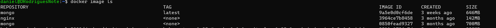
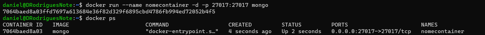
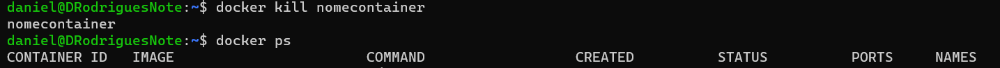
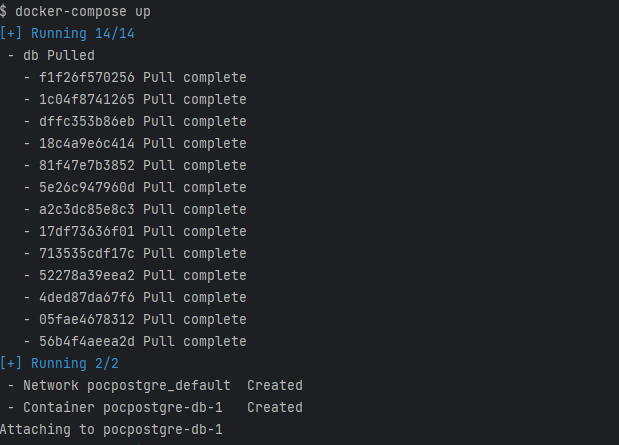

# Como criar um container

Seguindo os ultimos 2 tutoriais, eu acredito qe agora você já estaria habil para executar um container no docker.

Então, para fazer isso é simples, primeiro, você precisa executar o seguinte comando para baixar a imagem do sistema
que deseja, nesse caso usaremos o mongo de exemplo.
```
docker pull mongo
```

Você pode inclusive ver ela listada entre suas imagens executando docker image ls

Após isso, após ter a imagem de mongo em sua máquina, você pode executar o seguinte comando para executar um container 
de mongo.
```
docker run mongo
```
Esse comando executará um container, mas com umas configurações aleatórias e você precisará abrir uma nova aba no terminal,
pois aquela ficará "ocupada", porem podemos melhorar essa execução da seguinte maneira (fique tranquilo, pois vou explicar
cada parte do seguinte comando)

```
docker run --name nomecontainer -d -p 27017:27017 mongo 
```
* --name
quando executamos docker run sem nenhuma configuração, o container fica com um nome aleatório, com 
o comando --name, podemos pôr o nome que desejarmos nisso fica mais tranquilo na hora de trabalhar com ele, executar
pausar, excluir, etc...

* -d
este comando serve para o momento em que executamos um container, se você executar o comando acima sem esta parte, verá 
que o terminal ficará "ocupado" enquando o container executa, por isso é necessário o -d caso você não queira abrir uma
noca aba do terminal.
* -p
este serve para um fim mais específico, definir a porta em que o container é exposto, lembre do que eu falei, um container
é um "pedaço" isolado da memória feito só para aquele programa, então no caso do mongo, por exemplo, a porta padrão dele 
é exposta só dentro do container, esse comando serve para quando você quer, por exemplo, expor ela para a máquina, por assim dizer.   

Após tudos isso, você pode executar o comando e veremos que diferente de antes, que você executava docker ps e não aparecia nada,
agora aparece o container que criamos e executamos.



Após isso, você pode abrir outra aba do terminal e executar o comando mongo, para entrar no mongo shell e usar o mongodb
normalmente.


Você também pode apagar esse container se quiser com o seguinte comando
```
docker kill nomecontainer
```


Você pode também apenas pausar o container executando o mesmo comando, mas com um stop no lugar de kill. Nisso quando 
você executar *docker ps -a* (comando que serve para mostrar todos os container, não só os em execução igual o ps padrão) 
vai aparecer o container que criamos pausado e para executar ele novamente é a mesma coisa, mas com um start no lugar do stop.

## Docker-compose

Se você olhar dentre os arquivos deste porjeto, verá que temos um arquivo chamado docker-compose, ele serve para a mesma
função, executar containers, contudo de uma maneira mais adequada pensando em escopo de aplicação, pois é mais visivel e 
dá para fazer uma série de configurações, como a ordem dos containers, a rede deles e afins.

Vamos dar uma analisada nesse arquivo linha a linha, peguei o postgres como exemplo dessa vez:

Na linha 1, vemos a palavre "version" seguida do número 3,1 em aspas simples, isso se deve ao fato de que
os arquivos yaml são organizados pela identação, logo precisamos especificar a versão para podermos identar e a configuração 
funcionar corretamente.

Na linha 3 observamos a palavra services, aqui comessa a configuração que diz respoetio aso containers, os serviços que o 
docker vai subir para que a aplicação funcione corretamente.

Na linha 4 observamos a palavra db, que nada mais seria que o nome do serviço (container), aqui podemos por o nome que 
bem entendermos, mas preferi seguir a documentação e deixar como db mesmo. 
Da linha 5 para baixo observamos o que eu estava falando, sendo justamente a possibilidade configurar cada coisa do 
container, nesse caso, na linha 5 estamos dizendo a imagem que queremos, na inha 6 estamos dizendo que queremos
que o banco reinicie juntamente toda vez que o container pausar e reiniciar, e na parte de enviroment,
estamos definindo o user, a senha e o banco do container, para que na hora da conexão não seja qualquer um que 
consiga conectar. Nesse caso, você pode faer o teste, abra um debeaver da vida e tente conectar na porta 5432 sem 
essas configurações.

Na linha 11, estamos definindo a porta que o container irá executar.

Por fim na linha 13, estamos definindo os volumes do container que seria onde as informações do banco será salvo, 
se você ir nessa pasta de sua máquina, irá ver a informação sendo salva, com as pastas e tudo mais.

Agora na hora de executar, você pode abrir um terminal na pasta base do projeto e executar o seguinte comando:
```
docker-compose up -d
```
Com isso, você irá executar o docker-compose e ele criara um container com todas as imagens presentes nele, veja 
um print do docker desktop para mostrar-lhe como fica o cotainer.



